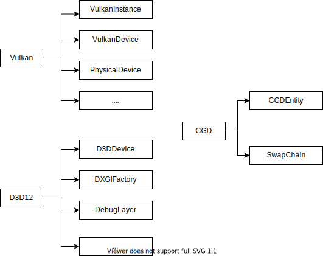

<!--
 * @CopyRight: MIT License
* Copyright (c) 2020 SaeruHikari
* Permission is hereby granted, free of charge, to any person obtaining a copy
* of this software and associated documentation files (the "Software"), to deal
* in the Software without restriction, including without limitation the rights
* to use, copy, modify, merge, publish, distribute, sublicense, and/or sell
* copies of the Software, and to permit persons to whom the Software is
* furnished to do so, subject to the following conditions:
* The above copyright notice and this permission notice shall be included in all
* copies or substantial portions of the Software.
* THE SOFTWARE IS PROVIDED "AS IS", WITHOUT WARRANTY OF ANY KIND, EXPRESS OR
* IMPLIED, INCLUDING BUT NOT LIMITED TO THE WARRANTIES OF MERCHANTABILITY,
* FITNESS FOR A PARTICULAR PURPOSE AND NONINFRINGEMENT. IN NO EVENT SHALL THE
* AUTHORS OR COPYRIGHT HOLDERS BE LIABLE FOR ANY CLAIM, DAMAGES OR OTHER
* LIABILITY, WHETHER IN AN ACTION OF CONTRACT, TORT OR OTHERWISE, ARISING FROM,
* OUT OF OR IN CONNECTION WITH THE SOFTWARE OR THE USE OR OTHER DEALINGS
*  IN THESOFTWARE.
* 
* 
 * @Description: 
 * @Version: 0.1.0
 * @Autor: SaeruHikari
 * @Date: 2020-03-05 13:54:51
 * @LastEditTime: 2020-03-05 15:49:29
 -->
<h1 align="left">CGD设备族</h1>
 
## 简介
&emsp;&emsp;为了不引入全局状态, 现代图形API往往需要用户创建并维护各式各样的对象, 例如VkInstance, D3D12Device, Queue, SwapChain, Fence等。CGD保持了这一特性, 因此所有的CGD函数都是静态无副作用的(就像您在Vk和D3D12看到的任一函数一样)。

&emsp;&emsp;CGD设备族就是现代图形API设备的一套抽象接口。

&emsp;&emsp;通过它您也可以不安全地访问到下层运行着的图形接口的具体设备, 但是并不推荐这样做。

## CGDInfo
为了创建CGDEntity, 您需要在CGDInfo中配置特性并在CGD::Initialize中传入。

- enableDebugLayer: 是否打开调试层, 默认false;
- extentionNames: 创建实体时需要的扩展名, 一般用于Vk;
- physicalDeviceFeatures: 硬件特异的特性们, 例如几何着色器, 光线追踪等。

## CGDEntity
对应着驱动现代图形API运作的一套设备对象们:

- physicalDevice: VkPhysicalDevice;
- instance: VkInstance, DXGIFactory;
- device: VkDevice, D3D12Device;
- debug: VkDebugUtilsMessengerEXT, D3DDebugLayer。

此外, CGDEntity还包含了一组设备唯一的[命令族]对象:

- queues: graphicsQueue, computeQueue, copyQueue各一条;
- contextManager: 用于申请CommandContext。